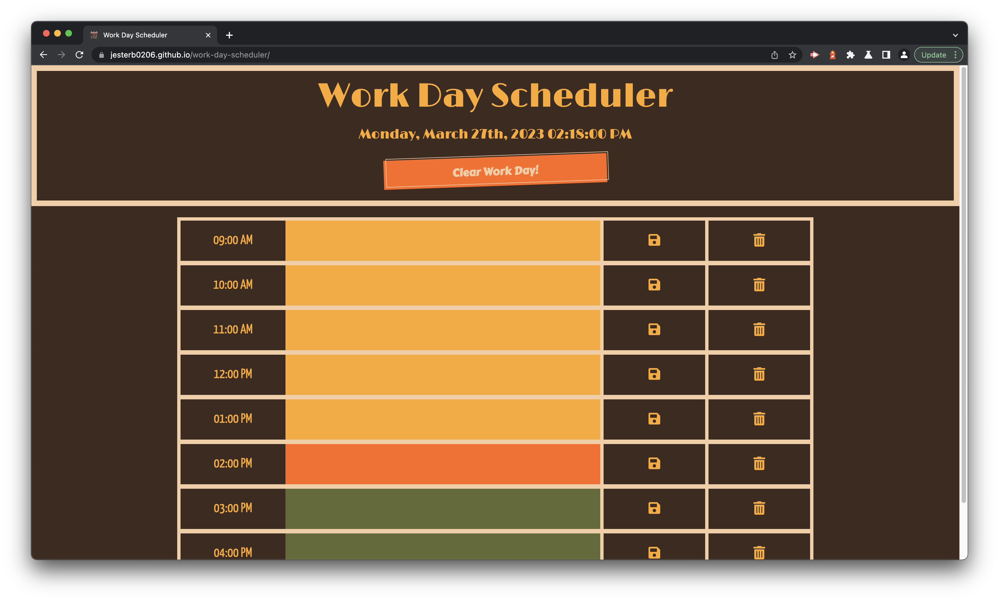

# Work Day Scheduler

## License

 

 

## Deployment Link

 

[Work Day Scheduler](https://jesterb0206.github.io/work-day-scheduler/)

 

## Table of Contents

 

**To-Do**

 

## Description

 

As a University of Washington Coding Boot Camp student, I have a busy schedule, and it can be difficult to effectively manage my time sometimes. I'll use my iPhone's Notes or Calendar apps to keep track of my daily tasks that need completing, but the user interface is dull and boring, and deleting tasks takes multiple clicks/taps. I decided to build this project to improve upon the existing gaps in notes/calendar apps that I see sometimes. As you go about your day, you'll get visual cues as to when it's time to start/end a task because each time block is color-coded to indicate whether it's that current hour, or if that hour is coming up or has already past. Once you complete that hour's tasks, you can erase them by selecting the trash can icon, or if the day has passed you can press the Clear Work Day! button and start with a fresh template to map out your next work day's to-do-list. The user interface features bold colors and fonts that harken back to the 1920s: much more exciting than most calendar apps! Through building this web application I was able to learn about Third-Party APIs such as Bootstrap, jQuery and Moment.js.

 

## Usage

A few things to note:

1. When you open the Work Day Scheduler, the current day is displayed at the top of the calendar, along with the current time in hours, minutes and seconds.
2. As you scroll down you'll be presented with time blocks for standard business hours. When you view the time blocks you'll see that each time block is color-coded to indicate whether it is in the past, present, or future. The past is represented by the color yellow, the present is represented by the color orange, and the future is represented by the color green.
3. When you click into a time block you can enter an event. If you wish to save it hover over the floppy disk icon and press it. You'll see that when you refresh the page the event/events persist because they're saved in local storage. Once an event is saved you can delete it by hovering over the trash can icon and pressing it. If you have events saved in multiple time blocks that you wish to delete press the Clear Work Day! button and your Work Day Scheduler will be completely initialized.

## Credits

 

Work Day Scheduler wouldn't be complete without the following sources:

1. https://colorleap.app/time/1920 - Color Leap (The color pallette I used for my web application was called Success)

2. https://digitalsynopsis.com/design/color-leap-historical-palettes/ - Digital Synopsis (This article was what led me to discover the Color Leap website)

3. https://fontawesome.com - Font Awesome (The save and delete icons came from here)

4. https://fonts.google.com - Google Fonts (I imported my font families from here)

5. https://getcssscan.com/css-buttons-examples - CSS Scan (The Clear Work Day! button is a modified version of Button 53 by Alpine Day)

6. https://momentjs.com - Moment (I used Moment.js 2.24.0 for my web application)

7. https://stackoverflow.com/questions/44712653/auto-refresh-at-the-top-of-every-hour - Stack Overflow (I used a code snippet from here)

8. https://www.1001fonts.com/1920s+google-web-fonts.html?page=1 - 1001 Fonts (I used Carter One, Limelight and Yanone Kaffeesatz for my web application)

 

## Badges

 

 

 

 

 

 

 

 

## Questions

 

If you have any additional questions, you can reach me at:

 

bradleyjester0@gmail.com
